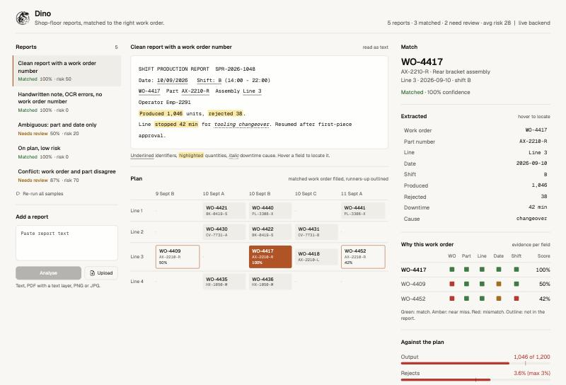

# Dino

[](https://github.com/ShlokVasandani/DINO/actions/workflows/ci.yml)

Shop-floor reports, matched to the right work order.

Operators write production reports in free text: handwritten notes, scans, shift logs. Dino reads them, pulls out the structured fields (work order, part number, line, shift, date, quantities, downtime), matches the report to the correct open work order with a confidence score, and scores it against the production plan so deviations surface immediately.

Built for **Smart India Hackathon 2026**, PS 26122 (Production Report to Production Plan Matching). It was not selected, so I finished it as a standalone project.



## The interface

A three-column workspace that follows your OS light or dark setting.

- **Reports** (left): an inbox with each report's status, confidence and risk. Paste text or upload a file to add one.
- **Report** (centre): the source text with the evidence Dino used marked in place. Identifiers are underlined, quantities highlighted, the downtime cause in italics. The plan below is a lines × shifts board where the matched work order is filled and runners-up are outlined with their scores.
- **Analysis** (right): the match and its confidence, a table of every extracted field (hover a row to locate it in the text), per-field evidence for the top candidates, and output, reject and downtime measured against the plan's allowances, with deviations and recommended actions.

With no backend reachable the UI falls back to a bundled snapshot of the sample results (`src/demo-data.json`, regenerated with `python backend/scripts/export_demo.py` and checked by a test), so the hosted build still works.

## How it works

1. **Extract** (`backend/dino/extract.py`): rule-based parsing that tolerates OCR confusions (`AX-22lO-R` → `AX-2210-R`), day-first dates, shift inferred from time ranges, and downtime in minutes or hours. A field it cannot find is `None`, never guessed.
2. **Match** (`backend/dino/match.py`): scores every open work order on the fields the report actually contains (work order ID 5, part number 3, line 1.5, date 1, shift 1), with a one-character part-number mismatch scoring only half credit so `AX-2210-R` is not confused with `AX-2210-L`. Little evidence caps confidence. A near-tie between candidates halves the confidence. Results are `matched`, `review` (low confidence, near-tie, or the report's work order and part disagree) or `unmatched`.
3. **Assess** (`backend/dino/assess.py`): compares output, reject rate and downtime against each work order's allowances, lists deviations with severity, suggests actions and gives a 0-100 risk score.

## Run it

```bash
# backend
cd backend
python -m venv .venv && source .venv/bin/activate
pip install -r requirements.txt
uvicorn dino.api:app --port 8000

# frontend (new terminal, repo root)
npm install
npm run dev
```

Open the app and try the sample reports, paste text, or upload a `.txt`, text-layer `.pdf`, or image. The frontend talks to `http://localhost:8000`; set `VITE_API_URL` to point elsewhere.

```bash
cd backend && pytest        # 18 tests: extraction, matching, scoring, API
```

## Limits

- **Image OCR** needs the Tesseract binary installed (`brew install tesseract`). Scanned PDFs must be uploaded as images; only PDFs with a text layer are read directly. Tested on a clean typed-report image (all 7 key fields recovered, matched WO-4417). On synthetically degraded images (rotated, blurred, JPEG-compressed, noisy) accuracy drops sharply, and simple preprocessing (upscale, denoise, thresholding) did not help reliably. Expect good results from clear, straight-on photos of typed reports, and poor results from rough photos or handwriting.
- **Handwriting:** OCR quality on real handwriting will vary. Extraction is tuned for typed or neatly written reports.
- **Data is synthetic.** The 12 work orders in `backend/dino/data/work_orders.json` and the sample reports are made up; there is no ERP integration.
- Extraction is rule-based, not an LLM. It is predictable and testable, but it will miss phrasings the patterns do not cover. Extending `extract.py` (or adding an LLM fallback behind the same interface) is the obvious next step.
- The hosted build runs in demo-snapshot mode (bundled samples only). Analysing your own reports needs the backend running locally.

## Stack

React + Vite, Tailwind, shadcn/ui, Framer Motion · Python, FastAPI, pypdf, Tesseract (optional) · pytest, GitHub Actions
